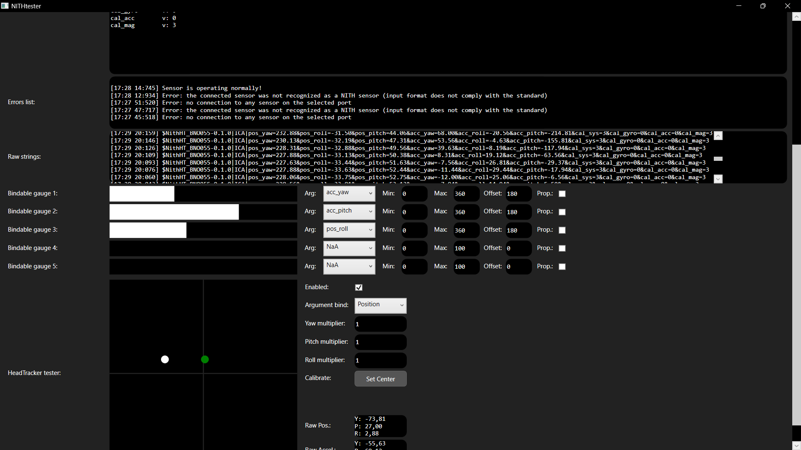

# NITHtester

A GUI for testing NITH sensor peripherals and wrappers.

## Description

NITHtester is a GUI application designed to monitor and test NITH sensor peripherals and wrappers. NITH is a collection of Open-Source solutions dedicated to accessibility for motor disabilities, with a focus on quadriplegic users. NITHtester provides various tools to monitor the output of the sensors that comply with the NITH standard. With NITHtester, you can easily visualize sensor data, check status codes, and identify any errors or issues.

 

  

 

## Installation

Please note that NITHtester is currently compatible with Windows systems only.

To install and run NITHtester, follow these steps:

1. Go to the [Releases page](https://github.com/LIMUNIMI/NITHtester/releases) of this repository.
2. Download the latest release.
3. Extract the downloaded files.
4. Run NITHtester.exe

## Usage Instructions

### Sensor Port

Connect your sensor to the appropriate COM (USB) port.

- In the "Sensor port" panel, select the connected port from the dropdown menu.
- Click the "Connect" button to establish a connection between the sensor and NITHtester.
- Once connected, the circular indicator light will turn from red to green.

### Sensor Information displays

- The "Sensor name" field displays the name of the connected sensor.
- The "Sensor version" field shows the version number of the sensor.
- The "Status code" field indicates the status code reported by the sensor. Refer to the [NITH sensors](https://github.com/LIMUNIMI/NITHsensors) readme for a list of status codes and their meanings.
- The "Extra data" field displays any additional information provided by the sensor that does not comply with the NITH standard. Refer to the [NITH sensors](https://github.com/LIMUNIMI/NITHsensors) readme for more details.

### Output displays

- The "Arguments and values" display shows the available sensor arguments and their corresponding values. Values can be in the format [base] or [base/max]. In the latter case, a third value (p:) represents the normalized value from 0 to 100.
- The "Errors list" displays any hardware or input parsing errors. Refer to the [NITH sensors](https://github.com/LIMUNIMI/NITHsensors) readme for a complete list of error types.
- The "Raw strings" section shows the raw, unparsed strings received from the sensor. Only the last 100 raw strings are displayed.

### Bindable Gauges

This feature feature allows you to map sensor arguments to visual bars for convenient visualization.

- Use the "Arg" dropdown to select the sensor argument you want to bind.
- Set the "Min" and "Max" thresholds to define the range of values to be mapped. Values outside this range will be discarded.
- The "Offset" field allows you to add a constant value to the sensor's output.
- If the "Prop" checkbox is selected, the gauge will be bound to the "p:" value described in the "Arguments and values" section.

### HeadTracker Tester

The "HeadTracker tester" provides a 2D graphical visualizer tool specifically designed for testing head trackers using standard NITH argument values. This tool will work best if rotational coordinates are expressed in euler format (-180° to 180°) for the yaw, pitch and roll axes, and accelerational data is expressed in rad/s.
The white dot will move according to Pitch and Yaw data, while the green dot will move according to Pitch and Roll data.

- To activate the visualizer, check the "Enabled" checkbox.

- Use the "Argument bind" dropdown to select whether you want to visualize "Position" (absolute rotation data) or "Acceleration" (gyroscope acceleration) data.
  
  - If "Position" is selected, the tool will look for *pos_yaw*, *pos_pitch* and *pos_roll* data from the sensor's input;
  
  - If "Acceleration" is selected, the tool will look for *acc_yaw*, *acc_pitch* and *acc_roll* data from the sensor's input.

- Adjust the "Yaw," "Pitch," and "Roll" multipliers to amplify the input data.

- Click the "Calibrate" button to center the head tracker for the current position.

- The "Raw Pos" and "Raw Accel" displays show the raw data for yaw, pitch, and roll in terms of position and acceleration.

## Contribute to Development

The source code for NITHtester is available in this repository. It is written in C# and can be opened with Visual Studio 2022 using the provided *.sln* solution file.

To contribute to the development of NITHtester, follow these steps:

1. Clone this repository to your local machine.
2. NITHtester depends on [NITHlibrary](https://github.com/LIMUNIMI/NITHlibrary). Clone it in an adjacent folder, so Visual Studio should be able to locate it automatically.
3. Open the *NITHtester.sln* solution file with Visual Studio.
4. Make your desired changes or additions to the code.

Feel free to fork this repository!

## License

This project is licensed under the [GNU GPLv3 license](https://www.gnu.org/licenses/gpl-3.0.en.html).

## Contact

For any questions or feedback regarding NITHtester, feel free to open an issue in this repository. You will find more informations about NITH on Nicola Davanzo's [personal website](https://neeqstock.notion.site/).
